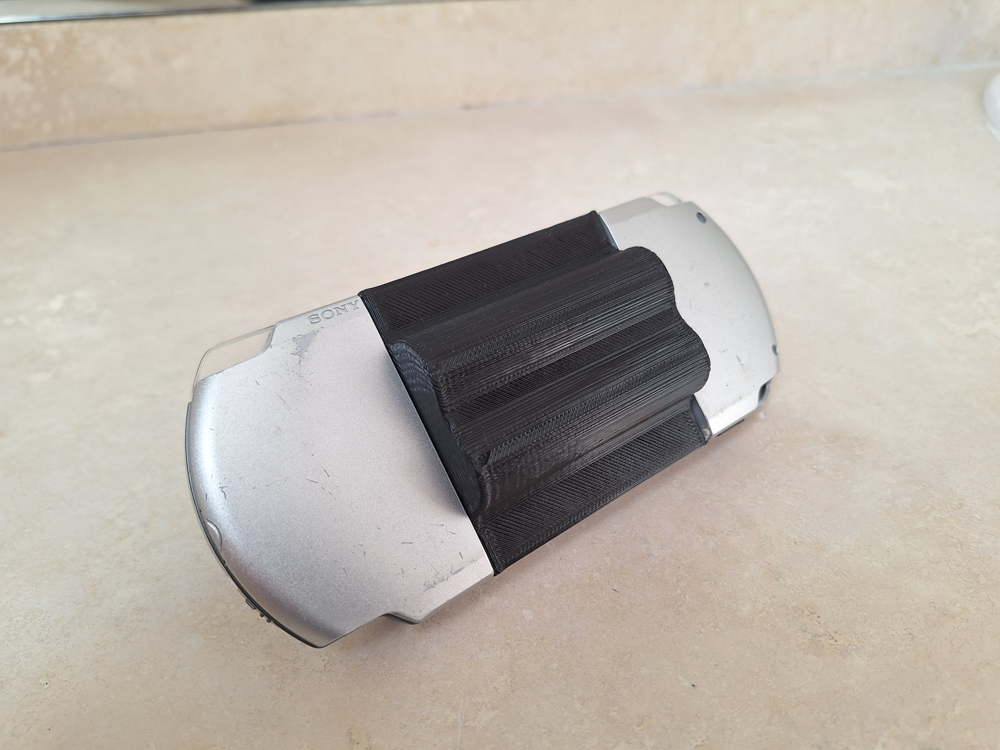

# PSP mod

## Description
For this project, I removed the UMD drive of my old PSP 3000 and replaced it with 2 18650 batteries. To do so, I repurposed the battery circuetry of the old battery, which I connected the 18650 batteries to it. The case was designed using SolidWorks and printed using PLA plastic. 

## Images

|||
|-|-|
|||
|||